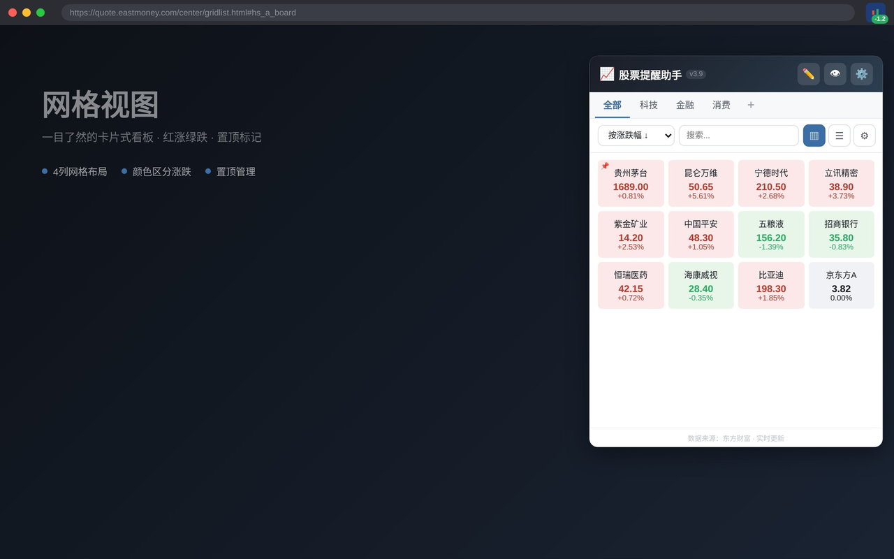
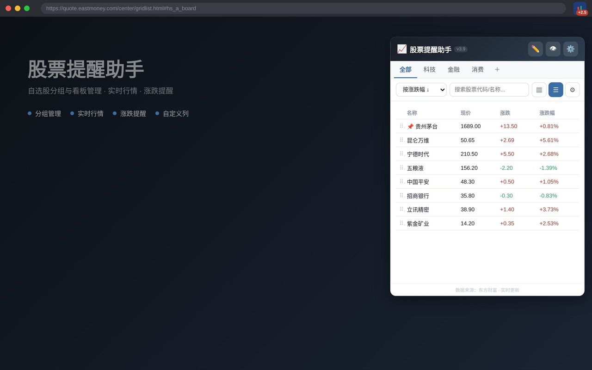
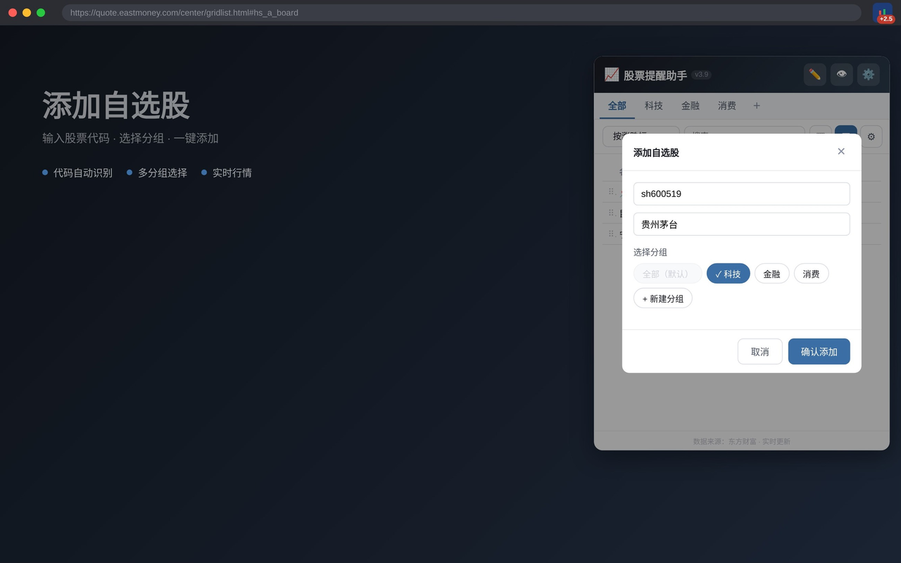

# 股票提醒助手 — 自选股分组与看板

[](https://github.com/orxz/stock-alert-extension/releases/tag/v1.1.0)
[](manifest.json)
[](LICENSE)

轻量级 Chrome 浏览器扩展，为 A 股投资者提供专业自选股管理工具。支持**沪深主板、科创板、创业板、北交所**全市场股票。

| 网格视图 | 列表视图 | 添加股票 |
|:---:|:---:|:---:|
|  |  |  |

## 功能

- **全市场覆盖** — 沪深主板 / 科创板（688/689）/ 创业板（300/301）/ 北交所（920/8xx/4xx）
- **多分组看板** — 自定义分组（最多 20 个），拖拽排序，一键切换
- **实时行情** — 东方财富 push2 API（主源）+ 新浪财经（备源）+ 演示数据（兜底），三级降级
- **双视图模式** — 网格卡片 / 数据列表，按涨跌幅、价格、成交额、自选时间排序
- **拖拽排序与置顶** — 股票卡片/行拖拽排序，一键置顶，跨分组拖拽
- **自定义列** — 12 字段自由勾选，拖拽调序
- **智能搜索补全** — 代码前缀 / 拼音首字母 / 中文名称 / 行业标签，实时 API 联想 + 本地降级
- **价格隐藏** — 一键隐藏/显示价格，适合投屏分享
- **后台提醒** — 浏览器角标实时显示置顶股票涨跌幅（红涨绿跌），图标悬停查看前 5 只
- **隐私安全** — 所有数据本地存储（chrome.storage.local），不上传任何用户数据

## 安装

### Chrome 商店

> 即将上架

### 开发者模式

1. 下载发行包 `stock-alert-extension-v1.1.0.zip` 并解压
2. 打开 Chrome，进入 `chrome://extensions`
3. 启用「开发者模式」
4. 点击「加载已解压的扩展程序」，选择解压目录

### 从源码

```bash
git clone git@github.com:orxz/stock-alert-extension.git
cd stock-alert-extension
# 在 chrome://extensions 中加载该目录
```

## 使用

### 添加股票

点击 `＋` 按钮，输入股票代码（如 `600519`）、拼音（如 `mt`）或中文名称（如 `茅台`），搜索联想将自动补全。系统会根据数字前缀自动识别市场：

| 输入 | 自动识别 | 市场 |
|------|:------:|------|
| `600519` | `sh600519` | 沪市主板 |
| `688981` | `sh688981` | 科创板 |
| `000001` | `sz000001` | 深市主板 |
| `300750` | `sz300750` | 创业板 |
| `920185` | `bj920185` | 北交所 |

### 管理分组

- 点击底部分组栏 `＋` 新建分组（上限 20 个）
- 右键分组名称可重命名或删除
- 拖拽分组调整顺序
- 选中股票 → 批量模式 → 移动到分组

### 看板操作

- **排序**：工具栏下拉选择排序方式，或列表视图中点击列标题
- **置顶**：点击卡片/行切换置顶状态，置顶股票始终排最前
- **拖拽**：在非批量模式下拖拽卡片/行调整手动排序
- **列配置**：点击 ⚙ 按钮，勾选/拖拽调整列表字段
- **价格隐藏**：点击 👁 按钮切换价格显示

## 行情数据源

| 优先级 | 名称 | 接口 | 说明 |
|:--:|------|------|------|
| 1 | 东方财富 | `push2.eastmoney.com` | 主源，JSON/UTF-8，实时行情 |
| 2 | 新浪财经 | `hq.sinajs.cn` | 备源，GBK 编码，扩展中可能受限 |
| 3 | 演示数据 | — | 兜底，本地模拟，标记「演示数据」 |

> 当行情数据来自演示数据时，界面底部会明确标注。

## 市场覆盖

| 市场 | 前缀 | 代码段 | 样本 |
|------|:--:|------|------|
| 沪市主板 | `sh` | 600/601/603/605 | 贵州茅台 sh600519 |
| 科创板 | `sh` | 688/689 | 中芯国际 sh688981 |
| 深市主板 | `sz` | 000/001 | 平安银行 sz000001 |
| 创业板 | `sz` | 300/301 | 宁德时代 sz300750 |
| 北交所 | `bj` | 920/8xx/4xx | 贝特瑞 bj920185 |

## 技术栈

- **平台**：Chrome Extension Manifest V3
- **前端**：原生 HTML/CSS/JavaScript（零框架、零构建工具、零依赖）
- **存储**：chrome.storage.local
- **后台**：Service Worker + chrome.alarms（30 秒定时刷新）
- **性能**：防抖写入（200ms）、虚拟滚动（>50 只）、搜索防抖（300ms）

## 文件结构

```
stock-alert-extension/
├── manifest.json          — 扩展清单
├── background.js          — Service Worker（角标/工具提示）
├── popup.html/css/js      — 弹窗 UI
├── quotes.js              — 行情数据层（API + 演示）
├── storage.js             — 本地存储层
├── docs/                  — 文档与截图
│   ├── 项目架构.md         — 架构概览
│   ├── module-*.md        — 模块技术笔记
│   └── design-v1.1.0-*.md — ADR 决策记录
├── icons/                 — 扩展图标
└── privacy/               — 隐私政策页面
```

## 隐私

本扩展**不上传任何用户数据**。所有自选股列表、分组配置、看板偏好均存储在本地 Chrome 存储中。详情见 [隐私政策](privacy/index.html)。

## 许可证

MIT
