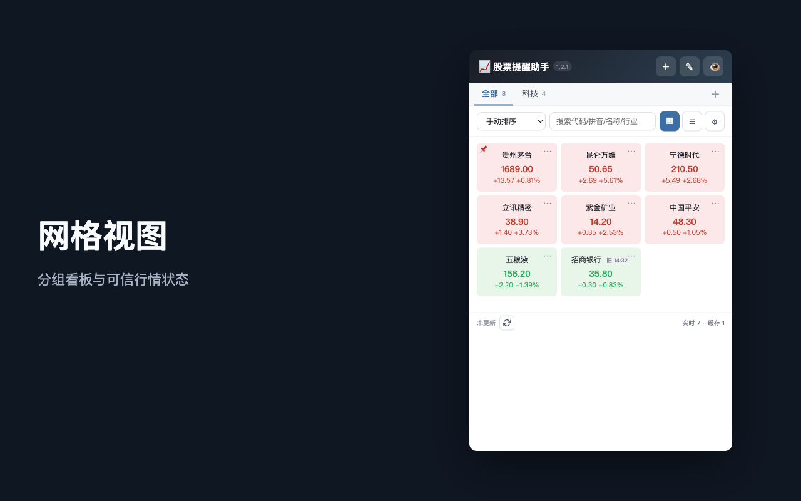
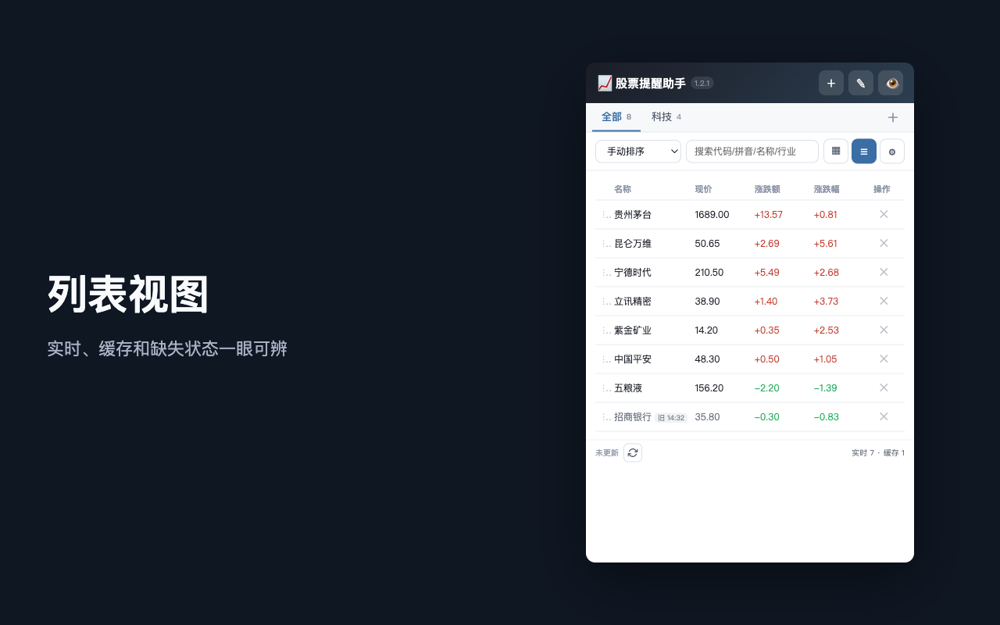
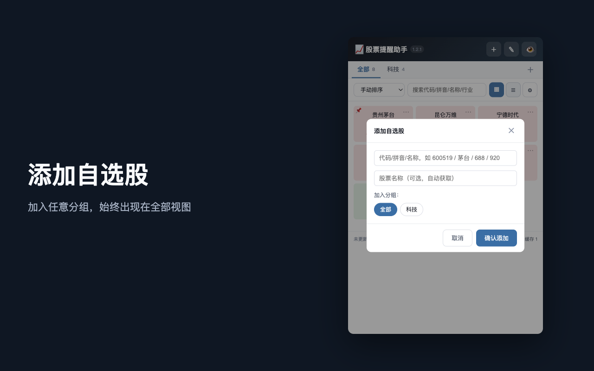

# 股票提醒助手 — 自选股分组与看板

[](https://github.com/orxz/stock-alert-extension/releases/tag/v2.0.0)
[](extension/manifest.json)
[](LICENSE)

A 股自选股看板 Chrome 扩展：分组管理、实时行情、排序联动角标。覆盖**沪深主板、科创板、创业板、北交所**，数据只存本地，行情状态如实标注（实时 / 缓存 / 缺失），绝不生成模拟价格。

| 网格视图 | 列表视图 | 添加股票 |
|:---:|:---:|:---:|
|  |  |  |

## 核心功能

- **多分组看板** — 最多 20 个自定义分组，拖拽排序；「全部」为计算视图，股票加入任意分组后始终可见
- **可信行情** — 东方财富主源 + 新浪备源，失败保留 7 天本地缓存；实时 / 缓存（旧 HH:MM）/ 缺失（`--`）三态明确
- **双视图 + 排序** — 网格卡片 / 数据列表，按涨跌幅、价格、成交额、自选时间排序，置顶与手动拖拽互不干扰
- **排序联动角标** — 工具栏图标实时显示排序第一只股票的涨跌幅（红涨绿跌，缓存灰显），悬停查看前 5 只
- **智能搜索** — 代码 / 拼音 / 中文名称联想补全，API 失败时自动降级本地搜索
- **实用细节** — 自定义 12 列、价格隐藏（投屏友好）、盘中 10 秒 / 盘外 5 分钟自适应刷新、虚拟滚动

## 安装

### Chrome 商店（推荐）

<a href="https://chromewebstore.google.com/detail/fmaalgiagnaeihdeninmdmohleangggh" target="_blank">
  
</a>

### 开发者模式

1. 下载发行包 `stock-alert-extension-v2.0.0.zip` 并解压
2. 打开 `chrome://extensions`，启用「开发者模式」
3. 点击「加载已解压的扩展程序」，选择解压目录

## 使用说明

### 三分钟上手

1. **添加股票** — 点击 `＋`，输入代码（`600519`）、拼音（`mt`）或名称（`茅台`），联想补全后确认；市场前缀自动识别（600→沪、300→创业板、920→北交所等）
2. **组织分组** — 底部分组栏 `＋` 新建分组（如「持仓」「观察」）；选中股票 → 批量模式 → 移动到分组
3. **看行情** — 工具栏切换排序方式，角标自动跟随显示第一只股票的涨跌幅；点状态栏 🔄 手动刷新

### 操作速查

| 操作 | 入口 |
|------|------|
| 切换网格 / 列表 | 工具栏视图按钮 |
| 排序 | 工具栏下拉，或列表视图点击列标题 |
| 置顶 / 拖拽排序 | 点击卡片或行；非批量模式下拖拽 |
| 重命名 / 删除分组 | 右键分组名称 |
| 自定义列 | 工具栏 ⚙（勾选 + 拖拽调序） |
| 隐藏价格 | 工具栏 👁 |
| 手动刷新 | 底部状态栏 🔄 |

### 看懂行情状态

| 状态 | 样式 | 含义 |
|------|------|------|
| 实时 | 红涨绿跌 | 30 秒内从行情源获取 |
| 缓存 | 灰色 + `旧 HH:MM` | 行情源暂不可用，展示 7 天内的本地缓存 |
| 缺失 | 灰色 `--` | 无可用数据（停牌、缓存超 7 天或损坏） |

状态栏汇总显示「实时 N · 缓存 M」；角标在缓存状态下灰显数字并标注过期时间。

## 更新历史

| 版本 | 要点 |
|------|------|
| **v2.0.0** | 基础架构重建：TypeScript + 原生 ESM + Light DOM Web Components；单一 StorageCoordinator 串行临界区 + 内容 revision 乐观并发；版本化 RPC v2（requestId / expectedRevision / 结构化错误）；可重试初始化屏障 + 持久化退避；不可变 Store + 语义 Commands + uncertain 对账；架构边界 / 无障碍 / 性能 / 容量门禁 |
| **v1.2.1** | 「全部」改计算视图；schema v2 自动迁移（含备份）；行情三态如实标注；缓存灰显角标；串行写入防数据丢失；E2E + CI 质量门禁；移除 Demo 模拟价格 |
| v1.2.0 | 底部状态栏（更新时间 + 手动刷新）；角标按排序联动；tooltip 显示排序后前 5 只 |
| v1.1.0 | 科创板 / 北交所支持；搜索 API 联想补全；搜索防抖防竞态 |
| v1.0.1 | 价格隐藏状态修复；列表虚拟滚动（>50 只） |
| v1.0.0 | 首个正式版：分组看板、双视图、拖拽排序、自定义列、智能搜索 |

完整日志见 [CHANGELOG.md](CHANGELOG.md)。

## 行情数据源

| 优先级 | 来源 | 说明 |
|:--:|------|------|
| 1 | 东方财富 `push2.eastmoney.com` | 主源，JSON，实时行情 |
| 2 | 新浪财经 `hq.sinajs.cn` | 备源，GBK 编码 |
| 3 | 本地缓存 `quoteCache:*` | 双源失败时保留 7 天，过期或损坏显示 `--` |

## 隐私

自选股、分组与看板配置仅保存在本地浏览器，开发者不收集不上传。查询行情时仅把股票代码发送给行情服务商，不包含姓名、邮箱、浏览记录或分组名称。详情见 [隐私政策](privacy/index.html)。

## 开发

零框架、零运行时第三方依赖（Manifest V3 + TypeScript + 原生 ES Modules + Chrome Storage）。源码在 `src/`，经 `tsc` 输出到 `build/extension/`，开发者模式和 Playwright 均加载 `build/extension/`。

```bash
npm install          # 安装开发依赖
npm run build        # TypeScript 编译 → build/extension/
npm run check        # 类型 + lint + 架构边界 + 构建产物 + manifest 校验
npm run test:unit    # 单元测试（覆盖率门禁 90/85/90/90）
npm run test:component  # 组件测试（happy-dom）
npm run test:e2e     # Playwright 真实扩展 E2E（加载 build/extension/）
npm run test:a11y    # axe-core 无障碍扫描
npm run ci           # 完整本地门禁
npm run release:verify  # 发布验证（含回滚 + 确定性构建）
```

| 目录 | 职责 |
|------|------|
| `src/domain/` | 领域模型（StockCode / Group / Quote / BoardConfig / 规则 / 格式化），纯 ES2022 |
| `src/protocol/` | RPC v2 单一注册表（方法 / payload / result / 运行时校验） |
| `src/application/` | 用例（Bootstrap / Portfolio Commands / QuoteService / SearchService）+ Ports |
| `src/infrastructure/` | Chrome Storage 适配器 + StorageCoordinator + Quote/Search Providers |
| `src/background/` | Service Worker：同步 listener 注册 + 可重试初始化屏障 + Router + Scheduler + Badge |
| `src/popup/` | 不可变 Store + Reducer + Selectors + Commands + Light DOM Web Components |
| `extension/` | 静态资源（manifest.json / popup.html / styles / icons / privacy） |
| `build/extension/` | tsc 输出 + 静态资源复制的可加载扩展（gitignored） |


更多技术细节见 [docs/项目架构.md](docs/项目架构.md) 与 `docs/module-*.md` 模块笔记。

## 许可证

MIT
