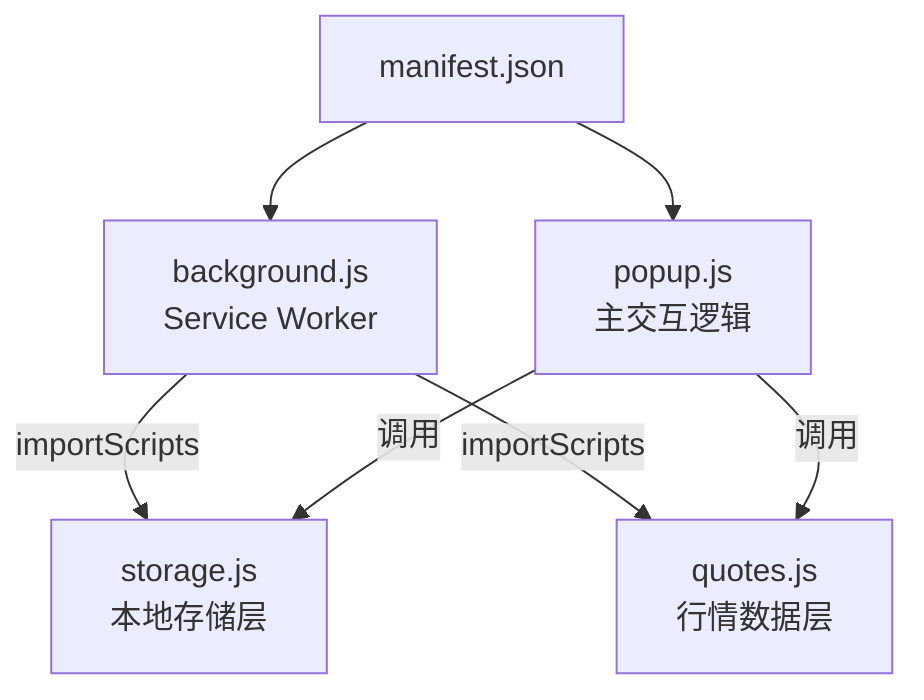

# 项目架构

## 架构概览

「股票提醒助手」是一款 Chrome 浏览器扩展（Manifest V3），为 A 股投资者提供轻量级的自选股管理工具。支持沪深主板、科创板、创业板、北交所全市场股票，具备多分组看板、实时行情、双视图、拖拽排序等功能。

**当前版本**：v1.1.0

## 文件结构

```
stock-alert-extension/
├── manifest.json      — 扩展清单（权限、入口注册）
├── background.js      — Service Worker（badge/tooltip 后台更新）
├── popup.html         — 弹窗 UI 结构
├── popup.css          — 弹窗样式（420px 固定宽度）
├── popup.js           — 主逻辑（分组/看板/排序/拖拽/模态框）
├── storage.js         — 本地存储层（chrome.storage.local）
├── quotes.js          — 行情数据层（东方财富+新浪双源+demo兜底）
├── icons/             — 扩展图标（16/48/128px）
├── privacy/           — 隐私政策页面
├── docs/              — 产品规格文档
└── store-assets/      — Chrome 商店素材
```

## 模块依赖关系



## 技术栈

| 层面 | 技术 |
|------|------|
| 运行平台 | Chrome Extension Manifest V3 |
| 前端 | 原生 HTML/CSS/JavaScript（无框架、无构建工具） |
| 存储 | chrome.storage.local |
| 后台 | Service Worker + chrome.alarms |
| 数据源 | 东方财富 push2 API（主）、新浪财经 hq.sinajs.cn（备） |

## 核心数据流

### 行情获取流程（三级降级）

```
Quotes.fetch(codes)
  → 1. 东方财富 push2 API（主源）
  → 2. 新浪财经 hq.sinajs.cn（备源，GBK 编码）
  → 3. demo 演示数据（兜底，标记 isDemo=true）
```

### 后台 Badge 更新

```
chrome.alarms（30秒周期）→ updateBadgeAndTitle()
  → 重入保护（_updating / _pending）
  → 置顶股票 → badge（涨跌幅+红绿背景）
  → 前5只 → tooltip（名称+涨跌箭头+涨跌幅）
```

## 关键设计决策

### 代码前缀规范（v1.1.0）

| 市场 | 前缀 | 代码特征 | 东财 market |
|------|------|----------|-------------|
| 沪市主板 | sh | 600/601/603 | 1 |
| 科创板 | sh | 688/689 | 1 |
| 深市主板 | sz | 000/001 | 0 |
| 创业板 | sz | 300/301 | 0 |
| 北交所 | bj | 920/8xx/4xx | 0 |

### 性能优化

- 配置写入防抖：200ms 延迟批量写入
- 虚拟滚动：列表超过 50 只时启用 content-visibility: auto
- 搜索防抖：300ms 输入间隔才触发 API 查询
- 搜索序号机制：_searchSeq 防止旧请求覆盖新结果
