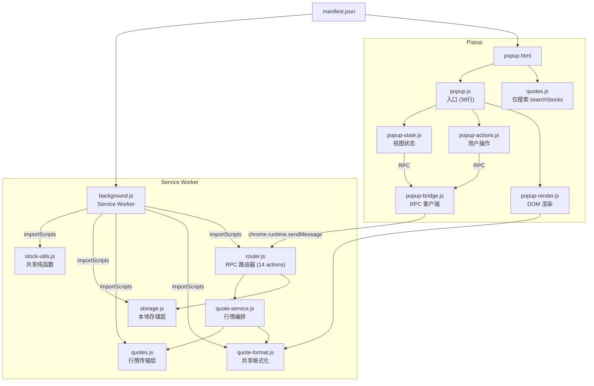

# 项目架构

## 架构概览

「股票提醒助手」是一款 Chrome 浏览器扩展（Manifest V3），为 A 股投资者提供轻量级的自选股管理工具。支持沪深主板、科创板、创业板、北交所全市场股票，具备多分组看板、实时行情、双视图、拖拽排序等功能。

**当前版本**：v1.3.0

## 文件结构

```
stock-alert-extension/
├── manifest.json       — 扩展清单（权限、入口注册）
├── background.js       — Service Worker（行情唯一所有者 / badge / tooltip / RPC 路由）
├── router.js           — RPC 路由器（14 个 action，消息总线）
├── quote-format.js     — 共享格式化模块（badge / tooltip / 时间 / 状态汇总）
├── popup.html          — 弹窗 UI 结构
├── popup.css           — 弹窗样式（CSS 设计令牌系统）
├── popup.js            — 弹窗入口（init 序列，38 行）
├── popup-bridge.js     — RPC 客户端（Bridge.send + 超时保护）
├── popup-state.js      — 视图状态管理（subscribe / notify / patch）
├── popup-render.js     — DOM 渲染（分组 / 看板 / 模态框 / 键盘导航）
├── popup-actions.js    — 用户操作（CRUD / 排序 / 拖拽 / 批量）
├── stock-utils.js      — 共享纯函数（代码规范化 / 分组视图 / 排序）
├── storage.js          — 本地存储层（schema v2 + 串行写入 + 行情缓存）
├── quotes.js           — 行情传输层（东方财富 / 新浪，搜索 API）
├── quote-service.js    — 行情编排（超时 / 分批 / 双源合并 / 缓存 / 退避）
├── icons/              — 扩展图标（16/48/128px）
├── privacy/            — 隐私政策页面
├── docs/               — 产品规格文档
└── store-assets/       — Chrome 商店素材
```

## 模块依赖关系


```mermaid
graph TB
    Manifest["manifest.json"]
    subgraph "Service Worker"
        BG["background.js<br/>Service Worker"]
        Router["router.js<br/>RPC 路由器 (14 actions)"]
        QuoteFormat["quote-format.js<br/>共享格式化"]
        StockUtils["stock-utils.js<br/>共享纯函数"]
        Storage["storage.js<br/>本地存储层"]
        Quotes["quotes.js<br/>行情传输层"]
        QuoteService["quote-service.js<br/>行情编排"]
    end
    subgraph "Popup"
        PopupHTML["popup.html"]
        PopupJS["popup.js<br/>入口 (38行)"]
        Bridge["popup-bridge.js<br/>RPC 客户端"]
        State["popup-state.js<br/>视图状态"]
        Render["popup-render.js<br/>DOM 渲染"]
        Actions["popup-actions.js<br/>用户操作"]
        PopupQuotes["quotes.js<br/>仅搜索 searchStocks"]
    end

    Manifest --> BG
    Manifest --> PopupHTML
    BG -->|"importScripts"| StockUtils
    BG -->|"importScripts"| Storage
    BG -->|"importScripts"| Quotes
    BG -->|"importScripts"| QuoteFormat
    BG -->|"importScripts"| Router
    Router --> QuoteService
    Router --> Storage
    QuoteService --> Quotes
    QuoteService --> QuoteFormat

    PopupHTML --> PopupJS
    PopupJS --> State
    PopupJS --> Actions
    PopupJS --> Render
    State -->|"RPC"| Bridge
    Actions -->|"RPC"| Bridge
    Bridge -->|"chrome.runtime.sendMessage"| Router
    Render --> QuoteFormat
    PopupHTML --> PopupQuotes
```

## 技术栈

| 层面 | 技术 |
|------|------|
| 运行平台 | Chrome Extension Manifest V3 |
| 前端 | 原生 HTML/CSS/JavaScript（无框架、无构建工具） |
| 存储 | chrome.storage.local |
| 后台 | Service Worker + chrome.alarms |
| 数据源 | 东方财富 push2 API（主）、新浪财经 hq.sinajs.cn（备） |

## 核心数据流

### Popup ↔ Service Worker RPC 消息总线（v1.3.0）

```
Popup (State/Actions)
  → Bridge.send(action, payload)
  → chrome.runtime.sendMessage({ action, payload })
  → Router.handleMessage(request, sender, sendResponse)
  → 分发到对应 handler（14 个 action）
  → { ok: true, data } 或 { ok: false, error: { code, message } }
  → Bridge 解包 Promise resolve / reject（10s 超时）

RPC action 列表：
  quote:read / quote:refresh         — 行情读取 /刷新
  storage:read / boardConfig / addStock / removeStocks / moveStocks
  / togglePin / setManualOrder / createGroup / renameGroup
  / deleteGroup / reorderGroups / saveBoardConfig
```

### 行情获取流程（真实数据 + 缓存）

```
QuoteService.read(codes)  — 被 Router 的 quote:read handler 调用
  → 读取本地按代码隔离的行情缓存
  → 30 秒内：标记 fresh（实时态）
  → 30 秒 ~ 7 天：标记 cached（缓存态）
  → 超过 7 天或损坏：删除并标记 missing

QuoteService.refresh(codes)  — 被 Router 的 quote:refresh handler 调用
  → 每 50 只一批，4 秒超时
  → 1. 东方财富 push2 API（主源）
  → 2. 缺失部分补查新浪 hq.sinajs.cn（备源）
  → 失败时保留未过期缓存并标记状态，绝不生成模拟价格
```

### 后台 Badge 更新

```
一次性 chrome.alarms（盘中 30 秒 / 盘外 5 分钟）→ updateBadgeAndTitle(source)
  → 重入保护（updating / pending）+ activeRun 共享 runId
  → StockUtils.getStocksForGroup(g_all) → StockUtils.sortStocks(...)
  → QuoteService.read 先渲染缓存 → refresh 后重渲染
  → QuoteFormat.formatBadge / formatBadgeState / formatTooltipLine 格式化
  → badge：实时红涨绿跌；缓存/缺失统一灰色
  → tooltip：前 5 只（名称+涨跌箭头+涨跌幅，缓存附「已过期 HH:MM」）
  → 可观测性：trigger(run-start)→boundary(onDiagnostic)→recovery(run-end) 共享 runId
```

### 可观测性诊断框架（v1.3.0+）

后台行情刷新链路通过共享 `runId` 实现三段可关联诊断：

- **QuoteService.create({ onDiagnostic })**：在 `provider-failed` / `refresh-empty` / `refresh-deferred` / `refresh-done` 四个节点发出结构化事件
- **createStorage({ onDiagnostic })**：缓存读写删除失败时发出 `cache-read/write/delete-failed` 并 rethrow 原错误
- **background.js**：`updateBadgeAndTitle` 入口生成 `runId`，通过 `emitDiagnostic` 将 QuoteService/Storage 的诊断事件关联到同一 run，在 `run-end` 标注 outcome（ok/failed）和 durationMs

## 关键设计决策

### 代码前缀规范（v1.1.0）

| 市场 | 前缀 | 代码特征 | 东财 market |
|------|------|----------|-------------|
| 沪市主板 | sh | 600/601/603 | 1 |
| 科创板 | sh | 688/689 | 1 |
| 深市主板 | sz | 000/001 | 0 |
| 创业板 | sz | 300/301 | 0 |
| 北交所 | bj | 920/8xx/4xx | 0 |

### 数据正确性

- schema v2：`g_all` 为计算视图，`groupIds` 只保存自定义分组
- 所有用户数据修改经串行写入队列，避免并发 lost-update
- 行情缓存按代码独立键存储，损坏条目自动忽略并清理
- 虚拟滚动：列表超过 50 只时启用 content-visibility: auto
- 搜索防抖：300ms 输入间隔才触发 API 查询
- 搜索序号机制：_searchSeq 防止旧请求覆盖新结果
- 弹窗刷新：盘中 10 秒 / 盘外 5 分钟（递归 setTimeout）
- 后台刷新：盘中 30 秒 / 盘外 5 分钟（一次性 alarm）
