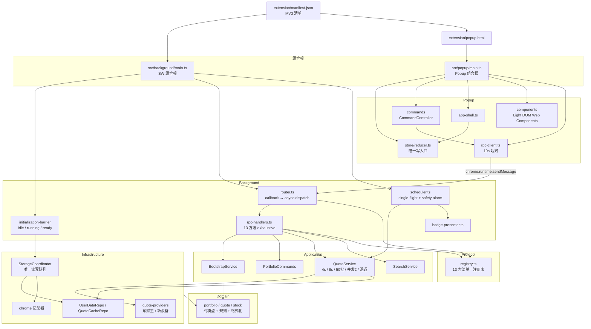

# 项目架构

## 架构概览

「股票提醒助手」是一款 Chrome 浏览器扩展（Manifest V3），为 A 股投资者提供轻量级的自选股管理工具。支持沪深主板、科创板、创业板、北交所全市场股票，具备多分组看板、实时行情、双视图、拖拽排序等功能。

**当前版本**：v2.0.0（TypeScript / ESM 重写版）

v2.0.0 将 v1 时代的扁平 JS 脚本架构重构为分层 TypeScript 架构：源码置于 `src/`（84 个 `.ts` 文件），经 `tsc --build` 编译到 `build/extension/runtime/`；静态资源（清单、HTML、样式、图标、隐私页）置于 `extension/`，构建时整体复制进 `build/extension/`。`build/extension/` 是 Chrome、开发者模式与 Playwright E2E 实际加载的扩展目录，而非源码根。Popup 与 Service Worker 通过 RPC v2（`chrome.runtime.sendMessage`，10s 超时）通信；行情编排与搜索只发生在 SW。

## 入口文件

| 文件 | 角色 |
|------|------|
| `extension/manifest.json` | 扩展清单（MV3）：`manifest_version: 3`，`action.default_popup` = `popup.html`，`background.service_worker` = `runtime/background/main.js`（`type: "module"`）；权限仅 `storage` + `alarms`；`host_permissions` 覆盖三个数据源域名 |
| `extension/popup.html` | 弹窗 UI 入口：`<stock-app hidden>` 自定义元素 + `#fatal-fallback` 致命错误回退 + `<app-live-region>` / `<app-dialog-host>`；`<script type="module" src="runtime/popup/main.js">`；链式加载 `tokens.css → layout.css → components.css` |
| `src/background/main.ts` | Service Worker 组合根：同步注册全部 Chrome listener（onMessage/onAlarm/onInstalled/onStartup/onChanged），通过可重试初始化屏障 `idle/running/ready` 惰性创建 `StorageCoordinator` + Application Services + Router + Scheduler |
| `src/popup/main.ts` | Popup 组合根：定义 Web Components、创建 `CallbackRpcClient` + 不可变 `Store`（reducer 唯一写入口）+ `CommandController` + `AppShell`，调用 `app:bootstrap`，调度行情刷新（盘中 10s / 盘外 5min 递归 setTimeout） |
| `build/extension/` | 构建产物：`tsc` 输出 `runtime/`（`background/main.js` + `popup/main.js`）+ 复制 `extension/` 静态资源；开发者模式与 Playwright 实际加载此目录 |

权限与域名（与 v1 一致，未变更）：权限 `storage` + `alarms`；`host_permissions` 覆盖 `https://push2.eastmoney.com/*`（东方财富行情，主源）、`https://hq.sinajs.cn/*`（新浪财经行情，备源）、`https://searchapi.eastmoney.com/*`（东方财富搜索）。

## 架构分层

```text
┌─────────────────────────────────────────────────────────┐
│  组合根（Composition Root）                                │
│  src/background/main.ts  (Service Worker)                │
│  src/popup/main.ts       (Popup)                         │
└──────────────┬──────────────────────────┬───────────────┘
               │                          │
   ┌───────────▼──────────┐   ┌───────────▼──────────┐
   │  Application 层        │   │  Popup 层             │
   │  用例编排 + Ports 接口  │   │  Store + Components   │
   │  BootstrapService      │   │  reducer(唯一写入)     │
   │  PortfolioCommands     │   │  CommandController    │
   │  QuoteService          │   │  Web Components(Light)│
   │  SearchService         │   └───────────┬──────────┘
   └───────┬──────────────┘                │ chrome.runtime
           │                               │   .sendMessage
   ┌───────▼──────────┐◄───────────────────┘
   │  Protocol 层       │
   │  registry.ts       │
   │  (13 方法单一注册表)│
   │  messages.ts 信封  │
   │  validators 校验   │
   └───────┬──────────┘
           │
   ┌───────▼──────────┐
   │  Domain 层         │  纯 ES2022，无 DOM/Chrome 依赖
   │  portfolio / quote │  值对象 + 纯规则 + 格式化
   │  stock / group     │
   │  board / brands    │
   └──────────────────┘

   ┌──────────────────┐  implements
   │  Infrastructure 层 │─────────────► Application Ports
   │  StorageCoordinator│  (chrome / storage / providers)
   │  Chrome Adapters   │  向内指向 application/domain，
   │  Quote Providers   │  从不反向
   └──────────────────┘
```

依赖只能由外向内：`background` / `popup`（组合根）→ `application`（用例 + Ports）→ `protocol`（RPC 契约）→ `domain`（纯模型）；`infrastructure`（Chrome / Storage / HTTP）实现 `application` 的 Ports 接口，向内指向 `application` / `domain`，从不反向。`scripts/check-architecture.mjs` 用 TypeScript Compiler API 解析 import graph，在 `npm run check` 阶段拒绝反向 import 与循环依赖。

## 文件结构

```
stock-alert-extension/
├── extension/                     — 静态资源（构建时复制进 build/extension/）
│   ├── manifest.json              — MV3 清单（权限 / 入口 / 域名）
│   ├── popup.html                 — 弹窗 HTML 骨架（<stock-app> + <script>）
│   ├── popup/styles/              — 弹窗样式（tokens.css / layout.css / components.css）
│   ├── icons/                     — 扩展图标（16 / 48 / 128px）
│   └── privacy/                   — 隐私政策页面
├── src/                           — TypeScript 源码（84 个 .ts 文件）
│   ├── domain/                    — Domain 层：portfolio / quote / stock / group / board-config / brands / errors / formatting（纯模型，无副作用）
│   ├── protocol/                  — Protocol 层：registry.ts（13 方法注册表）/ messages.ts（信封与 payload）/ validators.ts / error-codes.ts
│   ├── application/               — Application 层：bootstrap / portfolio / quotes / search / diagnostics + ports（接口）
│   ├── infrastructure/            — Infrastructure 层：storage（StorageCoordinator + repositories + sanitize/migration）/ chrome（适配器）/ quote-providers（东财 / 新浪 / 本地目录）
│   ├── background/                — SW 组合根：main.ts / scheduler.ts / router.ts / rpc-handlers.ts / initialization-barrier.ts / badge-presenter.ts
│   └── popup/                     — Popup 组合根：main.ts / app-shell.ts / rpc-client.ts / store（reducer 唯一写入）/ commands / components（Light DOM Web Components）/ a11y
├── build/extension/               — 构建产物（tsc 输出 runtime/ + 复制 extension/），Chrome 实际加载此目录
├── tests/                         — contracts（冻结 v1.3 契约）/ unit / component / e2e（Playwright 加载真实扩展）
├── scripts/                       — build / check-architecture / validate-manifest / verify-rollback / verify-deterministic-build 等
├── docs/                          — 产品规格与架构文档
└── store-assets/                  — Chrome 商店素材
```

## 模块依赖关系


```mermaid
graph TB
    Manifest["extension/manifest.json<br/>MV3 清单"]
    PopupHTML["extension/popup.html"]
    subgraph "组合根"
        BGMain["src/background/main.ts<br/>SW 组合根"]
        PopupMain["src/popup/main.ts<br/>Popup 组合根"]
    end
    subgraph "Background"
        Barrier["initialization-barrier<br/>idle / running / ready"]
        Router["router.ts<br/>callback → async dispatch"]
        Handlers["rpc-handlers.ts<br/>13 方法 exhaustive"]
        Scheduler["scheduler.ts<br/>single-flight + safety alarm"]
        Badge["badge-presenter.ts"]
    end
    subgraph "Popup"
        AppShell["app-shell.ts"]
        Store["store/reducer.ts<br/>唯一写入口"]
        Commands["commands<br/>CommandController"]
        Components["components<br/>Light DOM Web Components"]
        RpcClient["rpc-client.ts<br/>10s 超时"]
    end
    subgraph "Application"
        Bootstrap["BootstrapService"]
        Portfolio["PortfolioCommands"]
        QuoteService["QuoteService<br/>4s / 8s / 50批 / 并发2 / 退避"]
        Search["SearchService"]
    end
    subgraph "Protocol"
        Registry["registry.ts<br/>13 方法单一注册表"]
    end
    subgraph "Infrastructure"
        Coordinator["StorageCoordinator<br/>唯一读写队列"]
        Repos["UserDataRepo / QuoteCacheRepo"]
        Providers["quote-providers<br/>东财主 / 新浪备"]
        ChromeAdapters["chrome 适配器"]
    end
    subgraph "Domain"
        DomainModels["portfolio / quote / stock<br/>纯模型 + 规则 + 格式化"]
    end

    Manifest --> BGMain
    Manifest --> PopupHTML
    PopupHTML --> PopupMain

    BGMain --> Barrier
    BGMain --> Router
    BGMain --> Scheduler
    Barrier --> Coordinator
    Router --> Handlers
    Handlers --> Bootstrap
    Handlers --> Portfolio
    Handlers --> QuoteService
    Handlers --> Search
    Scheduler --> QuoteService
    Scheduler --> Badge

    Coordinator --> Repos
    QuoteService --> Providers
    QuoteService --> Repos
    Coordinator --> ChromeAdapters

    PopupMain --> Store
    PopupMain --> Commands
    PopupMain --> AppShell
    PopupMain --> Components
    PopupMain --> RpcClient
    Commands --> RpcClient
    AppShell --> Store

    RpcClient -->|"chrome.runtime.sendMessage"| Router
    Router --> Registry
    Handlers --> Registry

    Application --> DomainModels
    Infrastructure --> DomainModels
```

## 技术栈

| 层面 | 技术 |
|------|------|
| 运行平台 | Chrome Extension Manifest V3（Service Worker + Popup） |
| 语言 | TypeScript（ES2022 模块，`tsc --build` 编译，无打包器） |
| Popup UI | 原生 HTML/CSS + Light DOM Web Components（自定义元素，无框架） |
| 状态管理 | 不可变 Store（纯 reducer 唯一写入口） |
| 进程通信 | RPC v2（`chrome.runtime.sendMessage`，单一注册表，requestId + 结构化错误） |
| 存储 | `chrome.storage.local`（用户数据 + 行情缓存，经 StorageCoordinator 单队列）+ `chrome.storage.session`（退避状态） |
| 后台 | Service Worker + `chrome.alarms`（同步 listener + 可重试初始化屏障 + 安全 Alarm 调度） |
| 数据源 | 东方财富 `push2.eastmoney.com`（主源）、新浪财经 `hq.sinajs.cn`（备源）、东方财富 `searchapi.eastmoney.com`（搜索） |
| 构建 / 质量 | `tsc` 类型检查 + eslint + 架构边界 lint + node:test + Playwright E2E + axe 无障碍 |

## 核心数据流

### Popup ↔ Service Worker RPC v2 消息总线

```
Popup (CommandController)
  → CallbackRpcClient.call(method, payload)
      生成 requestId（crypto.randomUUID），构造 RpcRequest 信封 { protocol:2, requestId, method, payload }
  → chrome.runtime.sendMessage(request)
  → Background router.handle(request, sender, sendResponse)
      同步 return true（声明异步 sendResponse），dispatch 异步执行：
        1. validateRpcRequest：protocol===2 → requestId 非空 → method 在注册表 → payload 经方法校验器
        2. await barrier.get()（惰性初始化服务）
        3. 委托 handler（13 方法 exhaustive 表）
  → { protocol:2, requestId, ok:true, data } 或 { protocol:2, requestId, ok:false, error:{ code, message, retryable } }
  → RpcClient 解包：成功 resolve / 明确失败 reject / 10s 超时 → RpcUncertainError（不确定是否已提交）

RPC v2 注册表（src/protocol/registry.ts，13 方法）：
  app:bootstrap / quote:refresh / stock:search        — 只读：引导 / 刷新 / 搜索
  stock:add / stock:remove / stock:move / stock:setPinned / stock:setOrder  — 写命令（携带 expectedRevision）
  group:create / group:rename / group:delete / group:setOrder / preferences:patch — 写命令（携带 expectedRevision）
```

所有写命令是幂等最终态命令并携带 `expectedRevision`（乐观并发控制）：Background 重新读取最新数据 → 计算当前 digest → 与 `expectedRevision` 比对，冲突则返回 `CONFLICT` 且不写入；`requestId` 贯穿请求—响应全链路用于配对。

### 行情获取流程

```
QuoteService（src/application/quotes/quote-service.ts）编排：
  refresh(codes) — 被 quote:refresh handler 调用
    → 去重 + 过滤空值；按 CHUNK_SIZE=50 切批
    → 父级 8s 全局 deadline CancellationSource（取消所有未完成调用）
    → 最多 MAX_CONCURRENCY=2 批并发（v1 顺序逐批）
    → 每批独立 4s Provider 超时 CancellationSource（Clock.schedule 驱动）
    → 1. EastmoneyQuoteProvider（主源，push2.eastmoney.com）
    → 2. 缺失部分补查 SinaQuoteProvider（备源，hq.sinajs.cn）
    → 仅 price > 0 视为可用行情；绝不生成模拟价格
    → 缺失时保留未过期缓存并标记状态

  缓存策略（readBootstrap / read 时）：
    → 30 秒内：fresh（实时态）
    → 30 秒 ~ 7 天：cached（缓存态）
    → 超过 7 天或损坏：删除并标记 missing

  退避（失败累积）：
    → 序列 30s → 120s → 300s 循环
    → 持久化到 chrome.storage.session（SW 重建后恢复）
    → 空自选股：不请求网络，不改变退避状态
```

### 后台 Badge 更新与调度

```
QuoteScheduler（src/background/scheduler.ts）runQuoteCycle(source)：
  → single-flight 并发控制：活跃 run 进行中时新触发折叠为 pendingRun，
    活跃 run 结束后若 pendingRun 则以 'coalesced' 源重跑一次
  → safety-before-work：每次 cycle 开始先安排 5 分钟 safety alarm（防 SW 被杀后丢失调度）
  → exact-after-work：工作结束后安排精确 interval alarm（盘中 30s / 盘外 5min）
  → 空 watchlist：action.clear，不调 QuoteService 或 SessionState
  → badge / tooltip 投影：stocksForGroup(g_all) → sortStocks → read 缓存先渲染 → refresh 后重渲染
  → badge：实时红涨绿跌；缓存 / 缺失统一灰色
  → tooltip：前 5 只（名称 + 涨跌箭头 + 涨跌幅，缓存附「已过期 HH:MM」）
  → runId 贯穿诊断：cycle:start / cycle:end / update-action-failed 共享同一 runId
  → provider / cache 失败：updateAction 内部 catch，不抛出——调度循环不中断
```

### Service Worker 生命周期

```
src/background/main.ts（SW 顶层模块）：
  → 模块加载即同步注册全部 Chrome listener（onMessage / onAlarm / onInstalled / onStartup / onChanged），
    无顶层 await 先于 listener 注册——SW 在任何事件到达前完成接线
  → createRuntimeDependencies()：轻量 adapter（eager）+ Scheduler（eager）+ 惰性 barrier
  → barrier.initialize factory（首次 get() 时执行一次）：
      (a) 创建 Coordinator + Repositories + Services（迁移 / 备份）
      (b) coordinator.reconcileOrphanQuoteCache()——孤儿缓存清理
      (c) session.readQuoteBackoff——清理非法退避值后写回
      (d) scheduler.ensureAlarm()——SW 重建后恢复 alarm
  → ensureInitialized('module-activation') fire-and-forget：失败经诊断 sink 记录，下一事件重试
  → 初始化屏障三态：idle → running（并发首事件共享同一次 attempt）→ ready（缓存值）；
    失败回 idle（不缓存错误），下次 get() 重新触发
```

### 可观测性诊断

后台行情刷新链路与 RPC dispatch 通过结构化诊断 span 实现关联：

- **QuoteService**：在 `provider-failed` / `refresh-empty` / `refresh-deferred` / `refresh-done` 节点发出结构化 span（runId 贯穿）
- **StorageCoordinator**：缓存读写删除失败时发出诊断事件并 rethrow 原错误
- **Router**：每个 RPC 请求发射 `rpc` scope 的 `dispatch:start` / `dispatch:end` span
- **Scheduler**：`cycle:start` / `cycle:end` / `update-action-failed` 共享同一 runId，标注 outcome（ok / failed）与 durationMs

## 核心不变量

| 不变量 | 约束 |
|--------|------|
| **StorageCoordinator 单队列** | `src/infrastructure/storage/storage-coordinator.ts` 是 `chrome.storage.local` 的唯一业务调用者和唯一写入队列；所有用户数据 / 缓存读写进入同一串行临界区（单一 Promise tail），杜绝并发 lost-update。其下 `UserDataRepository` / `QuoteCacheRepository` 是薄能力包装 |
| **userDataRevision = SHA-256** | 规范化 `groups + watchlist + boardConfig` 的 SHA-256 摘要，用于乐观并发控制；不作为独立 key 持久化，每次写操作重新计算并比对 |
| **RPC v2 注册表** | `src/protocol/registry.ts` 是唯一的方法 / payload / result / validator 注册表（13 方法）；Popup Client 与 Background Router 共享；派生类型由注册表推导，不维护平行映射；新增方法只需一处登记 |
| **行情语义** | 4s Provider 超时 + 8s 总 deadline + 50 只 / 批 + 最多 2 批并发 + fresh `<30s` / cached `30s~7d` / 超期删除 + 失败退避 `30s→2m→5m` 持久化到 `chrome.storage.session`；`price > 0` 才可用；绝不生成模拟价格；空自选股不请求网络 |
| **Popup Store reducer 唯一写入口** | `src/popup/store/reducer.ts` 是纯函数 `(state, action) => state`，是 `AppState` 唯一写入口；只有 confirmed bootstrap / mutations 替换持久 Domain 数据；stale generation 拒绝；组件只接收 ViewModel、发出语义事件，不访问 Store / RPC / Repository |
| **SW 同步 listener + 初始化屏障** | SW 顶层模块同步注册全部 listener（无顶层 await 先于注册）；可重试初始化屏障 `idle / running / ready` 惰性创建服务，并发首事件共享 attempt，失败回 idle 下次重试；每次 SW 激活执行 `ensureAlarm` 恢复调度 |
| **schema v2 不变** | `groups` / `watchlist` / `boardConfig` / `quoteCache:<code>`；`g_all`（「全部」）是计算视图，不存储成员标记；迁移走 `migrateToV2`（幂等）并备份到 `migrationBackup:v1.2.1`（首次写入不覆盖） |
| **回滚安全** | v2 数据可被 v1.3.0 安全读取；不保留 v1 运行时代码（`verify-rollback.mjs` 在 `release:verify` 阶段验证） |

## 关键设计决策

### 代码前缀规范（v1.1.0，未变更）

| 市场 | 前缀 | 代码特征 | 东财 market |
|------|------|----------|-------------|
| 沪市主板 | sh | 600 / 601 / 603 | 1 |
| 科创板 | sh | 688 / 689 | 1 |
| 深市主板 | sz | 000 / 001 | 0 |
| 创业板 | sz | 300 / 301 | 0 |
| 北交所 | bj | 920 / 8xx / 4xx | 0 |

### 数据正确性

- schema v2：`g_all` 为计算视图，`groupIds` 只保存自定义分组
- 所有用户数据修改经 `StorageCoordinator` 单一串行队列，避免并发 lost-update；写操作通过 `expectedRevision`（SHA-256）乐观并发控制，冲突返回 `CONFLICT` 不写入
- 行情缓存按代码独立键（`quoteCache:<code>`）存储，损坏条目自动忽略并清理；写入前重新检查 code 是否仍在 watchlist（防孤儿）
- `price > 0` 才视为可用行情，缺失时保留未过期缓存，**绝不生成模拟价格**
- 虚拟滚动：列表超过 50 只时启用 `content-visibility: auto`
- 搜索防抖：300ms 输入间隔才触发 API 查询
- 搜索序号机制：generation 防止旧请求覆盖新结果
- 弹窗刷新：盘中 10 秒 / 盘外 5 分钟（递归 setTimeout）
- 后台刷新：盘中 30 秒 / 盘外 5 分钟（一次性 alarm）

## 命令面（package.json scripts）

| 命令 | 作用 |
|------|------|
| `npm run build` | `tsc --build` 编译 `src/` → `build/extension/runtime/`，复制 `extension/` 静态资源 |
| `npm run check:types` | `tsc --build tsconfig.json` 类型检查 |
| `npm run lint` | eslint 全量检查 |
| `npm run check:architecture` | TypeScript Compiler API 解析 import graph，拒绝反向 / 循环依赖 |
| `npm run check:runtime-imports` | 校验运行时 import 路径合法 |
| `npm run validate:manifest` | 校验 `extension/manifest.json`（权限 / 入口 / 域名） |
| `npm run check` | check:types + lint + check:architecture + build + check:runtime-imports + validate:manifest |
| `npm run test:contracts` | node:test 跑 `tests/contracts/`（冻结 v1.3 契约） |
| `npm run test:unit` | tsx + node:test 跑 `tests/unit/`，c8 覆盖率门槛 lines / statements / functions 90 / branches 85 |
| `npm run test:critical-coverage` | Domain / Protocol / Storage / Reducer per-file 门槛 95 / 90 / 95 / 95 |
| `npm run test:component` | tsx + happy-dom 跑 `tests/component/` |
| `npm run test:e2e` | Playwright 加载 `build/extension/` 真实扩展 E2E |
| `npm run test:a11y` | axe-core 无障碍扫描 |
| `npm run ci` | check + test:contracts + test:unit + test:critical-coverage + test:component + test:e2e + test:a11y |
| `npm run release:verify` | ci + test:performance + npm audit + verify-rollback + verify-deterministic-build + capture:store + package:extension + check:bundle |

## 风险路由表

| 变更场景 | 触及文件 | 注意事项 |
|----------|----------|----------|
| 改行情逻辑 | `src/infrastructure/quote-providers/`（传输 / 解析）、`src/application/quotes/quote-service.ts`（编排） | 退避状态持久化到 `chrome.storage.session`，SW 重建后恢复；`price > 0` 才可用，绝不生成模拟价格 |
| 改存储 schema / 字段 | `src/infrastructure/storage/sanitize-v2.ts` + `migration-service.ts` + `storage-coordinator.ts` | 必须保持 v1.2.1→v2 兼容；所有写操作走 Coordinator 单队列；`userDataRevision` 是 SHA-256 摘要，不单独持久化 |
| 新增 / 修改 RPC 方法 | `src/protocol/registry.ts`（单一注册表）+ `src/background/rpc-handlers.ts`（exhaustive handler 表） | 两端同步；payload 用注册表内联 validator 校验；派生类型由注册表推导 |
| 改 Popup 状态流 | `src/popup/store/reducer.ts`（唯一写入口）+ `selectors.ts` | 组件只接收 ViewModel、发出语义事件，不访问 Store / RPC / Repository；stale generation 拒绝 |
| 改 Badge / 调度 | `src/background/scheduler.ts` + `badge-presenter.ts` | safety-before-work + exact-after-work；single-flight 并发控制；runId 贯穿诊断 |
| 改 SW 初始化 | `src/background/main.ts` + `initialization-barrier.ts` | 同步注册 listener（无顶层 await 先于注册）；初始化屏障可重试；每次激活 `ensureAlarm` |
| 改权限 / 入口 / 域名 | `extension/manifest.json` | host_permissions 只允许三个数据源域名；权限仅 storage + alarms |
| 纯 Domain 改动 | `src/domain/*` | 优先跑 `tests/unit/domain/`；无 DOM / Chrome 依赖 |
| 改动后验证 | — | `npm run ci`（覆盖率门槛 + 架构边界 + 真实扩展 E2E + axe）；发布前 `npm run release:verify` |
