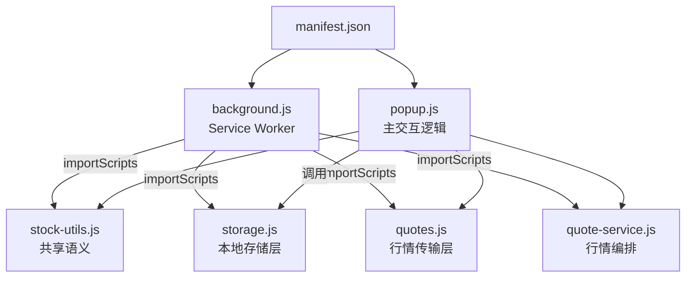

# 项目架构

## 架构概览

「股票提醒助手」是一款 Chrome 浏览器扩展（Manifest V3），为 A 股投资者提供轻量级的自选股管理工具。支持沪深主板、科创板、创业板、北交所全市场股票，具备多分组看板、实时行情、双视图、拖拽排序等功能。

**当前版本**：v1.2.1

## 文件结构

```
stock-alert-extension/
├── manifest.json      — 扩展清单（权限、入口注册）
├── background.js      — Service Worker（badge/tooltip 后台更新）
├── popup.html         — 弹窗 UI 结构
├── popup.css          — 弹窗样式（420px 固定宽度）
├── popup.js           — 主逻辑（分组/看板/排序/拖拽/模态框）
├── stock-utils.js     — 共享纯函数（代码规范化/分组视图/排序）
├── storage.js         — 本地存储层（schema v2 迁移 + 串行写入 + 行情缓存）
├── quotes.js          — 行情传输层（东方财富/新浪，仅负责请求与解析）
├── quote-service.js   — 行情编排（超时/分批/双源合并/缓存/退避）
├── icons/             — 扩展图标（16/48/128px）
├── privacy/           — 隐私政策页面
├── docs/              — 产品规格文档
└── store-assets/      — Chrome 商店素材
```

## 模块依赖关系


```mermaid
graph TB
    Manifest["manifest.json"]
    BG["background.js<br/>Service Worker"]
    Popup["popup.js<br/>主交互逻辑"]
    StockUtils["stock-utils.js<br/>共享语义"]
    Storage["storage.js<br/>本地存储层"]
    Quotes["quotes.js<br/>行情传输层"]
    QuoteService["quote-service.js<br/>行情编排"]

    Manifest --> BG
    Manifest --> Popup
    BG -->|"importScripts"| StockUtils
    BG -->|"importScripts"| Storage
    BG -->|"importScripts"| Quotes
    BG -->|"importScripts"| QuoteService
    Popup --> StockUtils
    Popup -->|"调用"| Storage
    Popup --> Quotes
    Popup --> QuoteService
```

## 技术栈

| 层面 | 技术 |
|------|------|
| 运行平台 | Chrome Extension Manifest V3 |
| 前端 | 原生 HTML/CSS/JavaScript（无框架、无构建工具） |
| 存储 | chrome.storage.local |
| 后台 | Service Worker + chrome.alarms |
| 数据源 | 东方财富 push2 API（主）、新浪财经 hq.sinajs.cn（备） |

## 核心数据流

### 行情获取流程（真实数据 + 缓存）

```
QuoteService.read(codes)
  → 读取本地按代码隔离的行情缓存
  → 30 秒内：标记 fresh（实时态）
  → 30 秒 ~ 7 天：标记 cached（缓存态）
  → 超过 7 天或损坏：删除并标记 missing

QuoteService.refresh(codes)
  → 每 50 只一批，4 秒超时
  → 1. 东方财富 push2 API（主源）
  → 2. 缺失部分补查新浪 hq.sinajs.cn（备源）
  → 失败时保留未过期缓存并标记状态，绝不生成模拟价格
```

### 后台 Badge 更新

```
一次性 chrome.alarms（盘中 30 秒 / 盘外 5 分钟）→ updateBadgeAndTitle()
  → 重入保护（_updating / _pending）
  → StockUtils.getStocksForGroup(g_all) → StockUtils.sortStocks(...)
  → QuoteService.read 先渲染缓存 → refresh 后重渲染
  → badge：实时红涨绿跌；缓存/缺失统一灰色
  → tooltip：前 5 只（名称+涨跌箭头+涨跌幅，缓存附「已过期 HH:MM」）
```

## 关键设计决策

### 代码前缀规范（v1.1.0）

| 市场 | 前缀 | 代码特征 | 东财 market |
|------|------|----------|-------------|
| 沪市主板 | sh | 600/601/603 | 1 |
| 科创板 | sh | 688/689 | 1 |
| 深市主板 | sz | 000/001 | 0 |
| 创业板 | sz | 300/301 | 0 |
| 北交所 | bj | 920/8xx/4xx | 0 |

### 数据正确性

- schema v2：`g_all` 为计算视图，`groupIds` 只保存自定义分组
- 所有用户数据修改经串行写入队列，避免并发 lost-update
- 行情缓存按代码独立键存储，损坏条目自动忽略并清理
- 虚拟滚动：列表超过 50 只时启用 content-visibility: auto
- 搜索防抖：300ms 输入间隔才触发 API 查询
- 搜索序号机制：_searchSeq 防止旧请求覆盖新结果
- 弹窗刷新：盘中 10 秒 / 盘外 5 分钟（递归 setTimeout）
- 后台刷新：盘中 30 秒 / 盘外 5 分钟（一次性 alarm）
